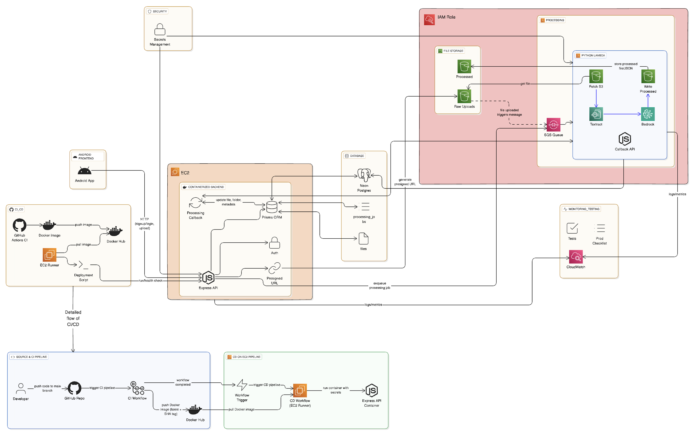

# ReceiptSnap – DevOps & Cloud Infrastructure

ReceiptSnap is a smart receipt processing system designed to extract, process,
and manage receipt data using cloud-native services.

This repository focuses exclusively on the **DevOps and Cloud infrastructure**
implementation of the project, including containerization, CI/CD automation,
and AWS deployment.

---

## 👩‍💻 My Role – DevOps & Cloud Engineer (Collaborative)

I worked **collaboratively with a team member** to design and implement the
DevOps and Cloud infrastructure for this project.

### Key Responsibilities:
- Dockerization of backend services (collaborative)
- CI/CD pipeline implementation using GitHub Actions
- Automated container build and deployment
- AWS EC2 deployment and configuration
- Integration of AWS services (S3, SQS, Lambda)
- IAM role configuration and access management
- Logging and monitoring using AWS CloudWatch

---

## 🏗️ System Architecture

The application follows a cloud-native, event-driven architecture.



---
---

## 🔁 CI/CD Pipeline Overview

### CI (GitHub Actions)
- Triggered on code push to `main` branch
- Builds Docker image using root-level Dockerfile
- Tags image with commit SHA
- Pushes image to Docker Hub

**CI Commands (run automatically in GitHub Actions):**
```bash
docker build -t receiptsnap-backend:latest .
docker push yourdockerhub/receiptsnap-backend:latest
```

### CD (AWS-EC2)
- EC2 runner pulls latest Docker image
- Stops old container (if any)
- Runs new container
- Environment variables injected securely
- Application becomes live automatically

**CD Commands (on EC2):
```bash
docker stop receiptsnap || true
docker rm receiptsnap || true
docker pull yourdockerhub/receiptsnap-backend:latest
docker run -d --name receiptsnap -p 80:3000 yourdockerhub/receiptsnap-backend:latest
```
---

## Local Setup Instructions

### 1. Prerequisites
	-	Git installed
	-	Docker installed (v20+)
	-	Node.js installed (v20+)
	-	AWS CLI configured
	-	Docker Hub account access

### 2. Clone Repository
```
git clone https://github.com/username/ReceiptSnap-DevOps.git
cd ReceiptSnap-DevOps
```

### 3. Install Dependencies
```
npm install
cp .env.example .env
node index.js
```
### 4. Docker Build & Run Locally
```
docker build -t receiptsnap-backend:latest .
docker run -d --name receiptsnap -p 3000:3000 receiptsnap-backend:latest
```
---

## ☁️ AWS Services Used

- **EC2** – Containerized backend deployment
- **S3** – Raw uploads and processed files storage
- **SQS** – Asynchronous job queue
- **Lambda** – Background processing
- **IAM** – Role-based access control
- **CloudWatch** – Logs and metrics monitoring
- **Textract** – OCR processing
- **Bedrock** – AI-powered data processing

---

## 🛠️ Tech Stack

- Docker
- GitHub Actions
- AWS (EC2, S3, SQS, Lambda, IAM, CloudWatch)
- Linux (Ubuntu)
- Git & GitHub

---
## 📌 References
	- GitHub Actions Docs
	- Docker Docs
	-	AWS Docs

---

## 📌 Credits & Acknowledgement

This project was developed as a **collaborative team project**.

The core application (backend and Android frontend) was implemented and
maintained in the following repositories:

- Backend: https://github.com/pratik50/ReceiptSnap-Backend  
- Android Frontend: https://github.com/pratik50/ReceiptSnap-Frontend-Android  

This repository focuses specifically on the DevOps & Cloud infrastructure
layer of the project, which was collaboratively implemented to handle
containerization, CI/CD automation, cloud deployment, and monitoring.
